# Arduino Component Tester

<p align="center">
  
  
  
  
</p>

An Arduino UNO-based multifunction **Electronic Component Tester** capable of measuring and identifying commonly used electronic components through a simple **16×2 LCD menu-driven interface**.

This project demonstrates analog signal measurement, ADC interfacing, embedded programming, and electronic component characterization using Arduino.

---

# Features

- Resistor Measurement
- Capacitor Measurement
- Inductor Measurement
- Silicon, Germanium & Zener Diode Detection
- LED Identification
- NPN & PNP BJT Detection
- Continuity Testing
- LDR Resistance Measurement
- LCD Menu Interface
- Push Button Navigation

---

# Hardware Used

- Arduino UNO
- 16×2 LCD Display
- Breadboard
- Push Buttons
- Resistors
- Capacitors
- Inductors
- Diodes
- LEDs
- BJTs
- LDR
- Jumper Wires

---

# Software Used

- Arduino IDE
- Tinkercad Circuit Simulator

---

# Folder Structure

```text
Arduino-Component-Tester/
│
├── README.md
├── LICENSE
├── .gitignore
├── code/
│   └── Arduino-Component-Tester.ino
├── circuit/
│   └── Schematic.pdf
├── images/
│   ├── hardware/
│   └── simulation/
└── docs/
    └── Arduino-Component-Tester.docx

```

---

# Working Principle

The tester uses a menu-driven interface displayed on a 16×2 LCD.

Using two push buttons, the user selects the desired measurement mode. Depending on the selected mode, the Arduino performs analog voltage measurements, timing analysis, or threshold detection to identify the connected component or calculate its electrical value.

The result is displayed directly on the LCD.

---

# Measurement Modes

| Mode | Function |
|------|----------|
| 1 | Resistor Measurement |
| 2 | Inductor Measurement |
| 3 | Capacitor Measurement |
| 4 | Diode Detection |
| 5 | LED Identification |
| 6 | BJT Detection |
| 7 | Continuity Test |
| 8 | LDR Measurement |

---

# Tinkercad Simulation

🔗 **Interactive Simulation**

https://www.tinkercad.com/things/6FzkCr1LbFs-advanced-multimeter?sharecode=Vx-necX7GMrY8QaXz7o8Sx1Pgvu9k-Aa0CUvpKsUsqs

---

# Circuit Diagram

The complete circuit schematic is available in

```
circuit/Schematic.pdf
```

---

---

# Documentation

A detailed project report containing the design methodology, circuit implementation, testing procedure, and results is available here:

📄 **[Arduino Component Tester Project Report](docs/Arduino-Component-Tester.docx)**

> **Note:** This report was originally prepared as part of an academic project submission at Pune Institute of Computer Technology (PICT).

---

# Demonstration

## Capacitor Measurement

<p align="center">
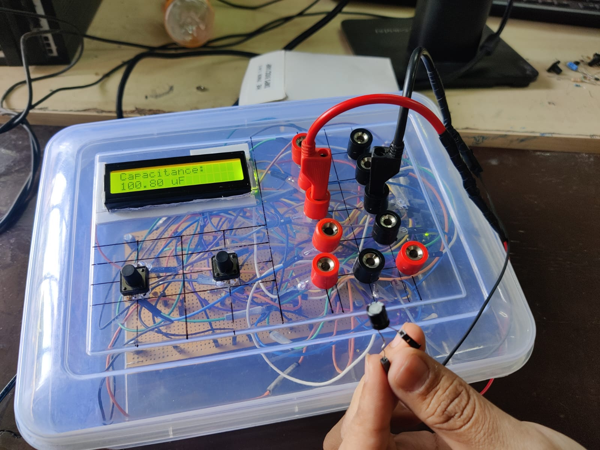
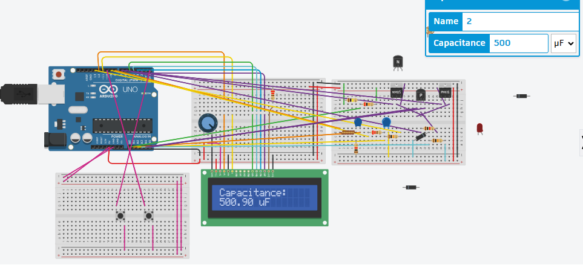
</p>

---

## Continuity Test

<p align="center">
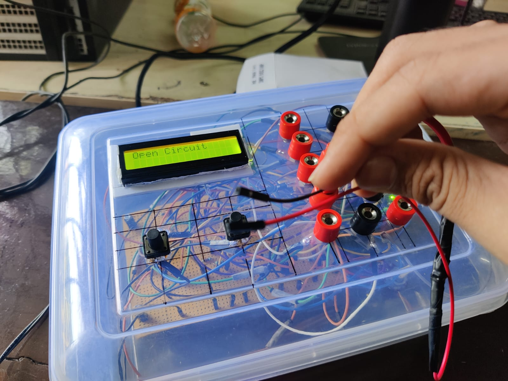
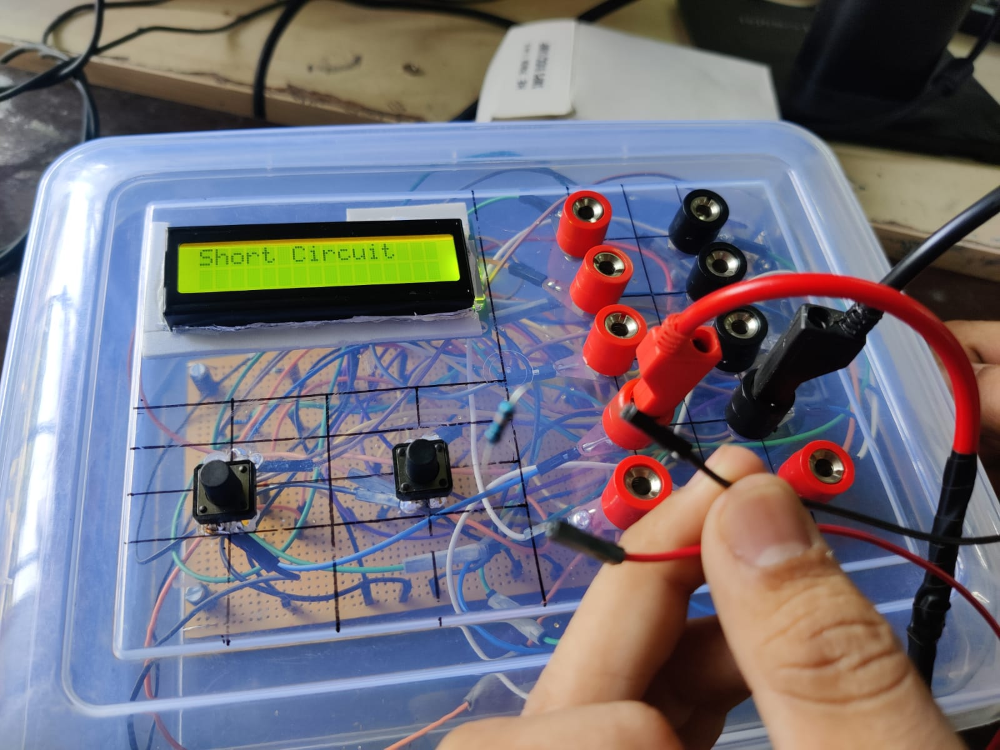
</p>

---

## Diode Detection

<p align="center">
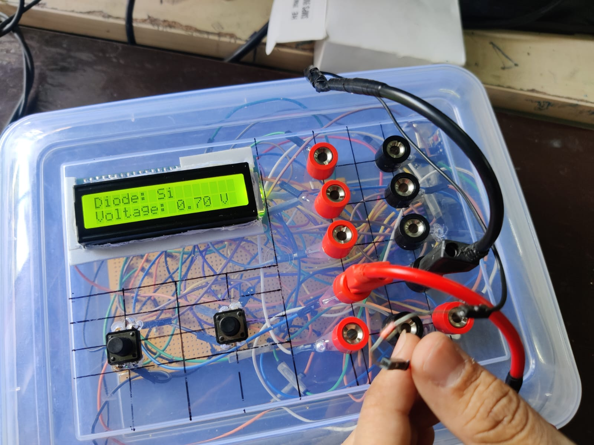
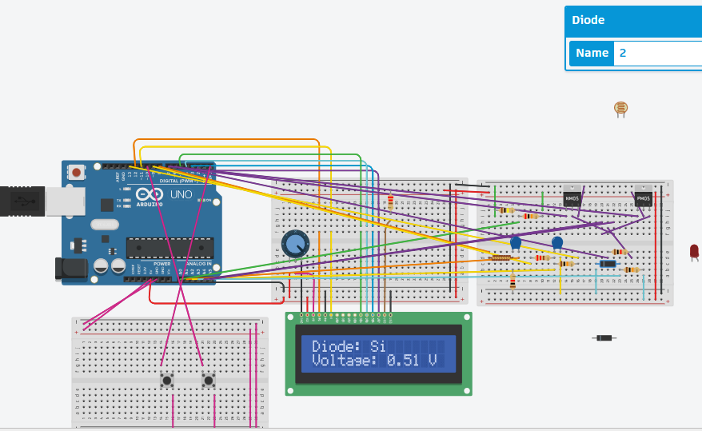
</p>

---

## LED Identification

<p align="center">
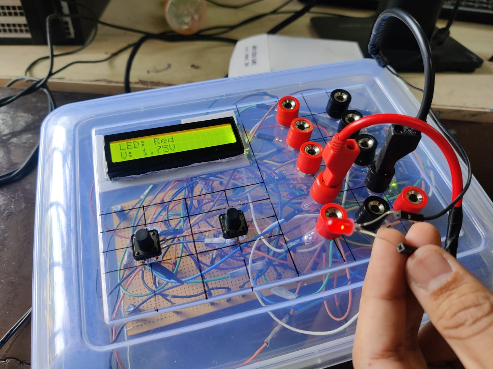
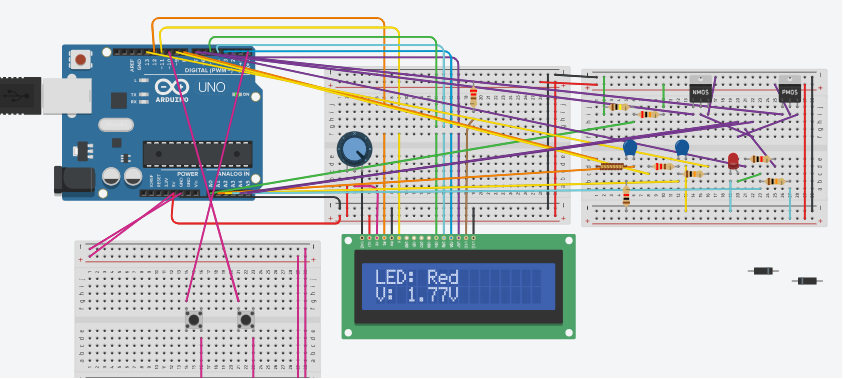
</p>

---

## NPN Transistor Detection

<p align="center">
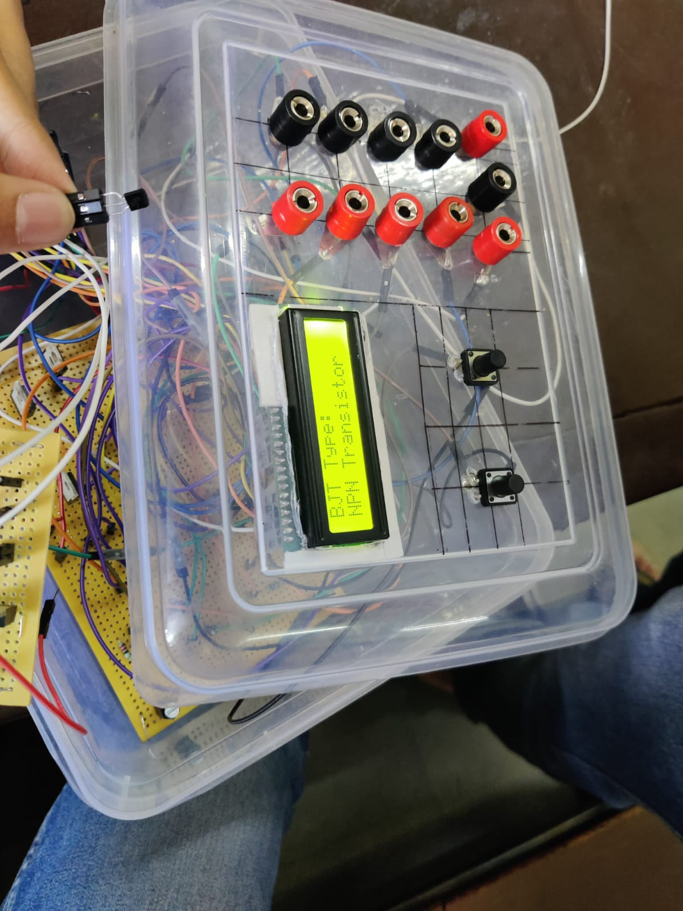
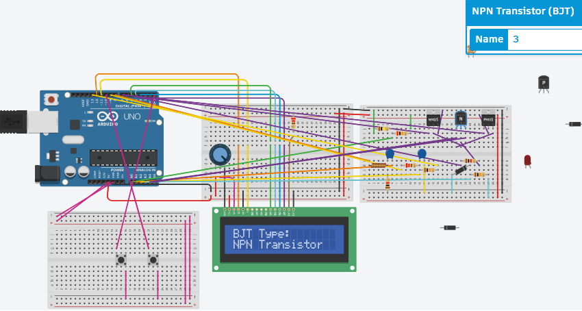
</p>

---

## PNP Transistor Detection

<p align="center">
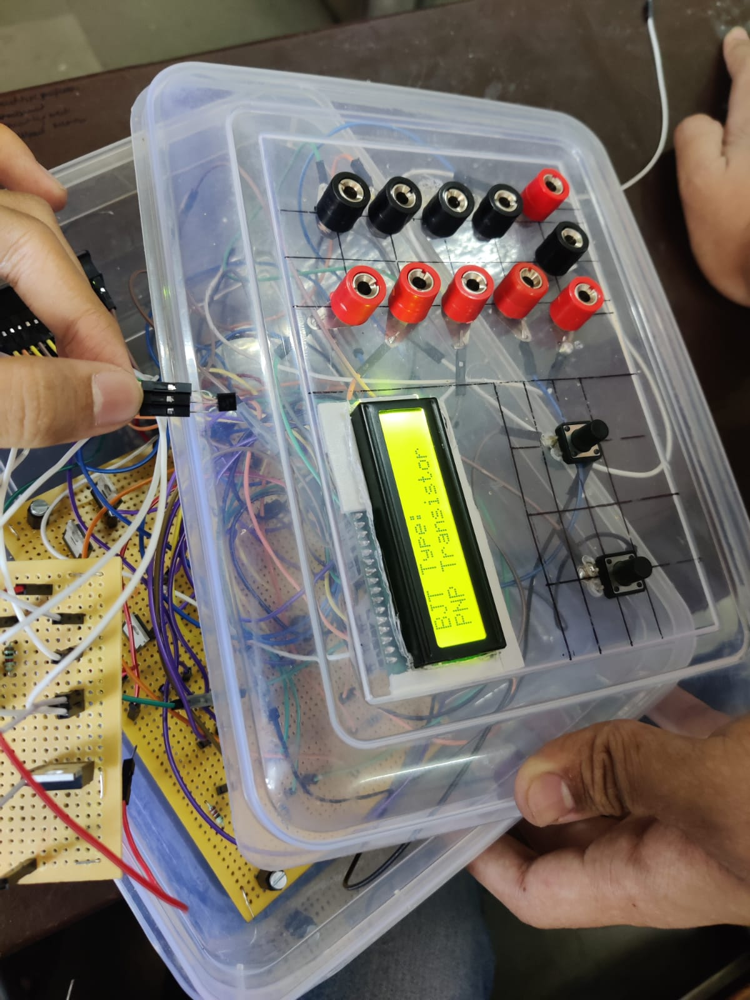
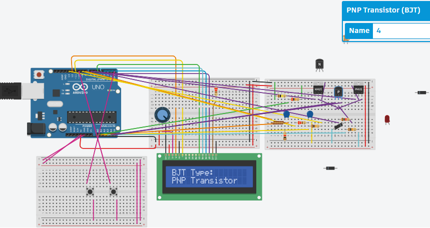
</p>

---

## Zener Diode Detection

<p align="center">
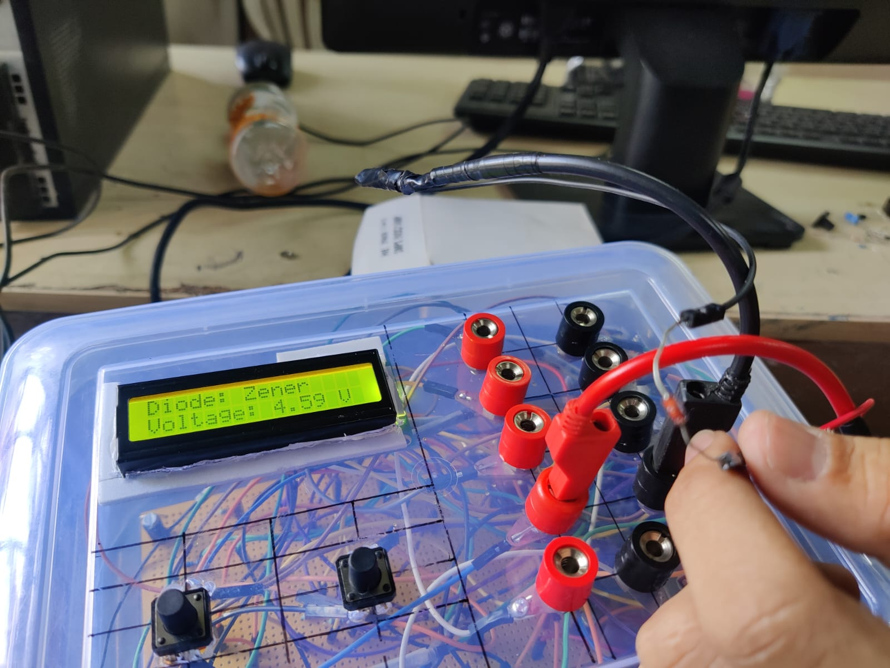

</p>

---

## Resistor Measurement

<p align="center">
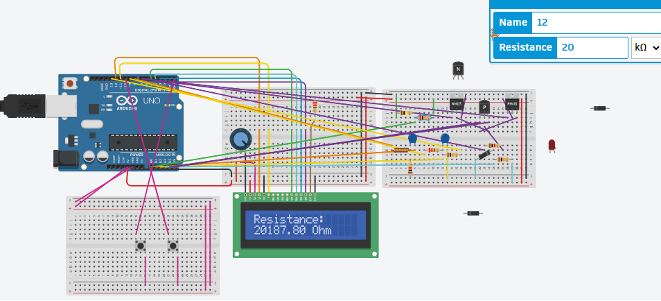
</p>

---

## Inductor Measurement

<p align="center">
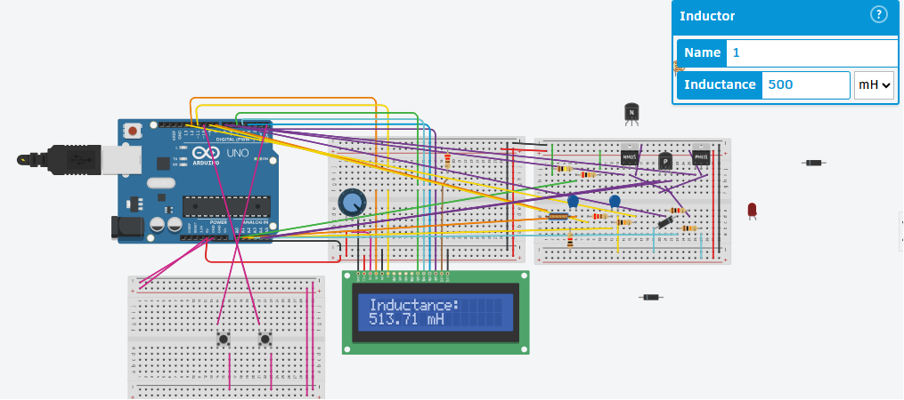
</p>

---

## LDR Measurement

<p align="center">
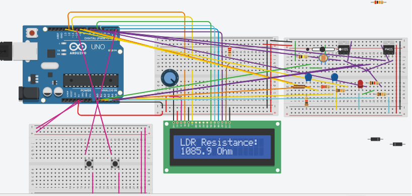
</p>

---

# Learning Outcomes

This project provided practical experience in:

- Embedded Systems Programming
- Arduino Programming
- Analog Electronics
- ADC Interfacing
- Electronic Component Testing
- LCD Interfacing
- Instrumentation
- Circuit Design

---

# Future Improvements

- Automatic component recognition
- Auto-ranging measurements
- OLED/TFT graphical display
- PCB implementation
- Battery-powered operation
- ESR measurement
- MOSFET characterization

---

# Author

**Akshay Patankar**

BE Electronics & Telecommunication Engineering  
Honours in Artificial Intelligence & Machine Learning

Pune Institute of Computer Technology (PICT)

---

# License

This project is licensed under the MIT License.
